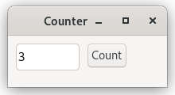
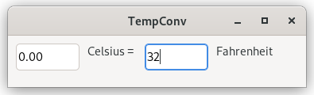
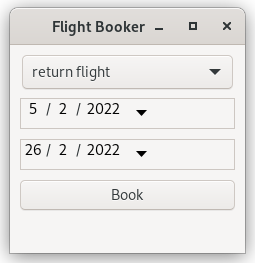
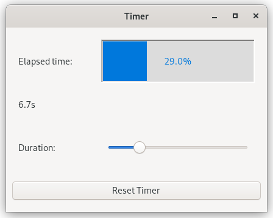
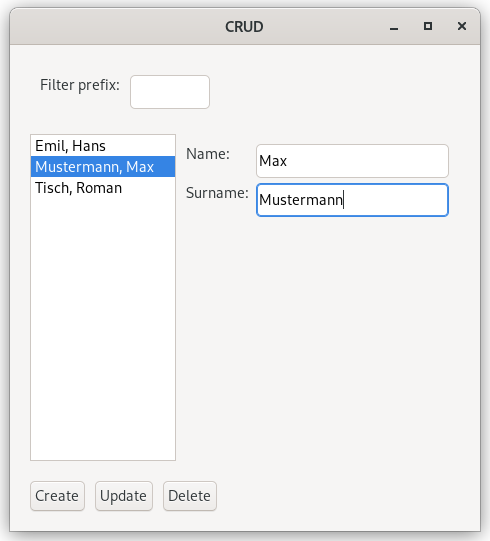
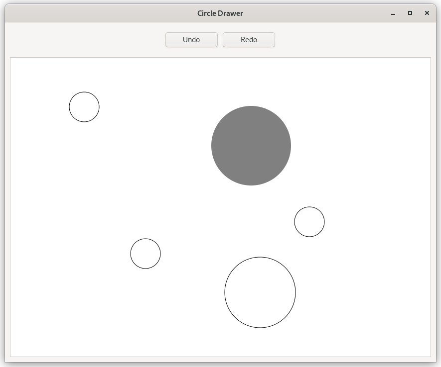
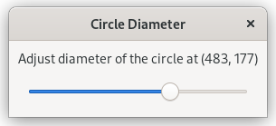
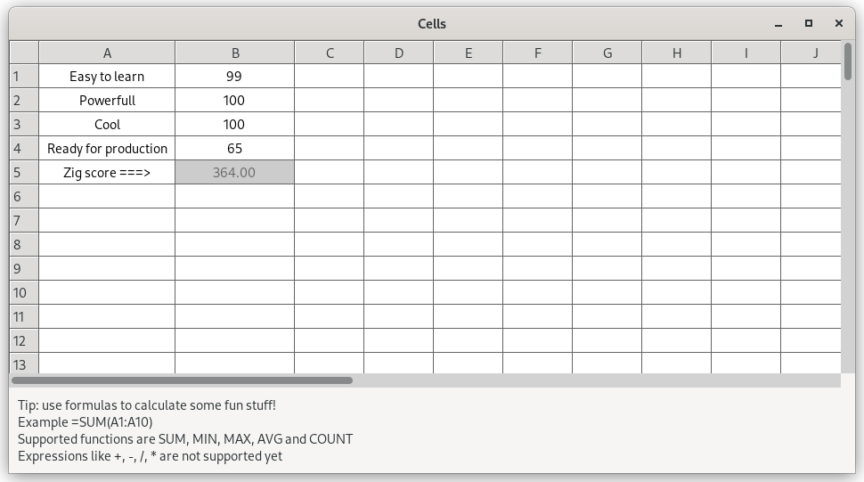

# 7GUIs Challenge done in IUPforZig

The 7GUIs is a set of 7 tasks to be implemented using a GUI proposed by Eugen Kiss in his master's thesis as a way to evaluate GUI toolkits. By implementing those 7 task one should be able to compare different GUIs in any language with a similar comparison base. See his web site for more details on the task and on the proposed evaluation: https://eugenkiss.github.io/7guis/.

The tasks will also help beginners to understand simple and complex tasks in GUI programming serving as a common tutorial.

## 1. Counter

*Challenge*: Understanding the basic ideas of a language/toolkit.



[counter.zig](src/counter.zig)

## 2. Temperature Converter

*Challenges*: bidirectional data flow, user-provided text input.



[temp_conv.zig](src/temp_conv.zig)

## 3. Flight Booker

*Challenge*: Constraints.




[book_flight.zig](src/book_flight.zig)

## 4. Timer

*Challenges*: concurrency, competing user/signal interactions, responsiveness.



[timer.zig](src/timer.zig)

## 5. CRUD

*Challenges*: separating the domain and presentation logic, managing mutation, building a non-trivial layout.



[crud.zig](src/crud.zig)

## 6. Circle Drawer

*Challenges*: undo/redo, custom drawing, dialog control.




[circle.zig](src/circle.zig)

## 7. Cells

*Challenges*: change propagation, widget customization, implementing a more authentic/involved GUI application.



[cells.zig](src/cells.zig)

# How to run

Each task can be launched by `zig build` using the corresponding task name:

```sh
Steps:
  install (default)            Copy build artifacts to prefix path
  uninstall                    Remove build artifacts from prefix path
  counter                      1. Counter
  tempConv                     2. Temperature Converter
  bookFlight                   3. Flight Booker
  timer                        4. Timer
  crud                         5. Crud
  circle                       6. Circle Drawer
  cells                        7. Circle Drawer
  test                         Run library tests
```

# Acknowledgements

### 7GUIs reference implementation
https://eugenkiss.github.io/7guis-React-TypeScript-MobX/

### 7GUIs implementation in IUP
https://www.tecgraf.puc-rio.br/iup/en/7gui/7gui.html
