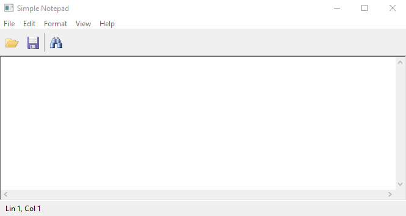
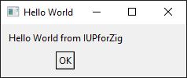

# IUP for Zig
[]()
[]()
[]()
[]()

A [Zig language](https://ziglang.org/) idiomatic and type-checked bindings for [IUP Portable User Interface Toolkit](https://webserver2.tecgraf.puc-rio.br/iup/)

## Examples

- [Simple notepad (in progress)](docs/simple_notepad.md)
- [7GUIs](7gui/ReadMe.md)
- [Button](docs/button.md)
- [Image](docs/image.md)
- [List](docs/list.md)
- [Tree](docs/tree.md)
- [MDI](docs/mdi.md)
- [Gauge](docs/gauge.md)
- [Tabs](docs/tabs.md)




## First look

A simple hello world example looks like this:

```Zig
const iup = @import("iup.zig");

pub fn main() !void {
    try iup.MainLoop.open();
    defer iup.MainLoop.close();

    var main_dialog = try (iup.Dialog.init()
        .setTitle("Hello World")
        .setChildren(
        .{
            iup.VBox.init()
                .setMargin(10, 10)
                .setGap(10)
                .setAlignment(.ACenter)
                .setChildren(
                .{
                    iup.Label.init()
                        .setTitle("Hello World from IUPforZig"),
                    iup.Button.init()
                        .setTitle("OK")
                        .setActionCallback(exit),
                },
            ),
        },
    ).unwrap());
    defer main_dialog.deinit();

    try main_dialog.showXY(.Center, .Center);
    try iup.MainLoop.beginLoop();
}

fn exit(button: *iup.Button) !void {
    iup.MainLoop.exitLoop();
}
```

Resulting in this:




## IUP Metadata

This project contains source-code automatically generated by [The IUP Metadata Project](https://github.com/batiati/IUPMetadata).

Most of the hard/repetitive work was done by code-gen tool, however, the API guidelines and all the interop code belongs here on this project.

## API

Zig does not require any special treatment to use C libraries, so to use IUP in Zig, it is as simple as adding `@cInclude("iup.h") ` in your source code, no need for special bindings!

This project attempts to create Zig bindings for IUP Toolkit with idiomatic and type-checked API, where none of the original IUP's declarations are exposed in the public interface, only names and concepts are kept as close as possible.

## Comparison:

1. IUP [simple example](https://webserver2.tecgraf.puc-rio.br/iup/examples/tutorial/example3_1.c) in C:

```C
#include <stdlib.h>
#include <iup.h>

int main(int argc, char **argv)
{
  Ihandle *dlg, *multitext, *vbox;

  IupOpen(&argc, &argv);

  multitext = IupText(NULL);
  vbox = IupVbox(
    multitext,
    NULL);
  IupSetAttribute(multitext, "MULTILINE", "YES");
  IupSetAttribute(multitext, "EXPAND", "YES");

  dlg = IupDialog(vbox);
  IupSetAttribute(dlg, "TITLE", "Simple Notepad");
  IupSetAttribute(dlg, "SIZE", "QUARTERxQUARTER");

  IupShowXY(dlg, IUP_CENTER, IUP_CENTER);
  IupSetAttribute(dlg, "USERSIZE", NULL);

  IupMainLoop();

  IupClose();
  return EXIT_SUCCESS;
}
``` 

2. Equivalent example in Zig:

```zig
const iup = @import("iup.zig");

pub fn main() !void {
    try iup.MainLoop.open();
    defer iup.MainLoop.close();

    var main_dialog = try (iup.Dialog.init()
        .setTitle("Simple Notepad")
        .setSize(.Quarter, .Quarter)
        .setChildren(
        .{
            iup.VBox.init()
                .setChildren(
                .{
                    iup.Text.init()
                        .setMultiline(true)
                        .setExpand(.Yes),
                },
            ),
        },
    ).unwrap());
    defer main_dialog.deinit();

    try main_dialog.showXY(.Center, .Center);
    try iup.MainLoop.beginLoop();
}
```

## How to build

1. Download [Zig](https://ziglang.org/download/);

2. Install IUP shared libraries and run:

> NOTE: [curl](https://curl.se/) is needed to download IUP binaries.

**Linux**
```bash
./install_iup.sh
zig build run
```

**Windows**
```cmd
.\install_iup.bat
zig build run
```

>For more information, please visit IUP's download page for your platform:
>https://sourceforge.net/projects/iup/files/3.30/

>Dependencies for `libim` and `libcd` may be required:
>https://sourceforge.net/projects/imtoolkit/files/3.15/
>https://sourceforge.net/projects/canvasdraw/files/5.14/

## Pending work

- [X] Support for collections and indexed attributes (list items for example)

- [ ] Complete the [Simple Notepad](https://github.com/batiati/IUPforZig/blob/master/src/example.zig) example.

- [X] Support Linux and Windows (using shared libs)

- [ ] Investigate how to build IUP from C sources in Zig.

- [ ] More tests, and sanitize failing tests.

- [ ] Additional controls (image library, matrix, GLCanvas, scintilla, plot, etc)

Feel free to place any comments/issues/PRs, it will be very nice to receive any feedback 🚀.

## Prior Art

Some great projects that served as inspiration.

- [Common Lisp CFFI bindings](https://github.com/lispnik/iup)

- [Iup4D is a D binding library](https://github.com/Heromyth/Iup4D)

- [IUP Rust](https://github.com/dcampbell24/iup-rust)

## License

* This project is a free and unencumbered software released into the public domain. Plese visit [unlicense.org](https://unlicense.org/) for more details.

* IUP is a [Tecgraf](http://www.tecgraf.puc-rio.br)/[PUC-Rio](http://www.puc-rio.br) project licensed under the terms of the [MIT license](http://www.opensource.org/licenses/mit-license.html). Please visit https://www.tecgraf.puc-rio.br/iup/ for more details.
