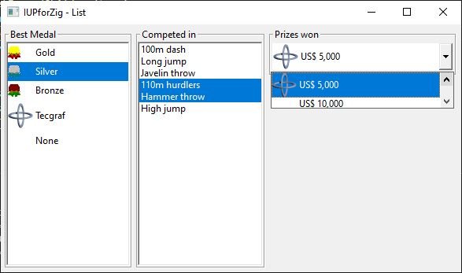
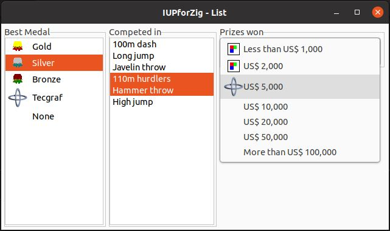

# IUP for Zig

## WIP Work in Progress

A [Zig language](https://ziglang.org/) idiomatic and type-checked bindings for [IUP Portable User Interface Toolkit](https://webserver2.tecgraf.puc-rio.br/iup/)

## List example

Creates a dialog with three frames, each one containing a list.
The first is a simple list, the second one is a multiple list and the last one is a drop-down list.
The second list has a callback associated.

Source code: [list_example.zig](../src/list_example.zig).

> Type `zig build list` to run this example.

Converted from original example in C
https://webserver2.tecgraf.puc-rio.br/iup/examples/C/list1.c

## Screenshots

Windows Classic

Ubuntu

