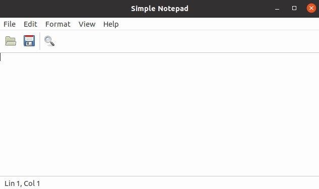

# IUP for Zig

## WIP Work in Progress

A [Zig language](https://ziglang.org/) idiomatic and type-checked bindings for [IUP Portable User Interface Toolkit](https://tecgraf.puc-rio.br/iup/)

## Simple Notepad (in progress)

A simple, but fully featured Notepad application using lots of IUP resources.

Source code: [notepad_example.zig](../src/notepad_example.zig).

> Type `zig build run` to run this example.

Converted from original tutorial in C
https://tecgraf.puc-rio.br/iup/examples/tutorial/simple_notepad.c

See the excellent [IUP tutorial](https://tecgraf.puc-rio.br/iup/en/tutorial/tutorial3.html) for a guided step-by-step explanation.

## Screenshots

Windows Classic

Ubuntu

