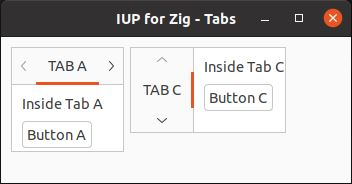

# IUP for Zig

## WIP Work in Progress

A [Zig language](https://ziglang.org/) idiomatic and type-checked bindings for [IUP Portable User Interface Toolkit](https://webserver2.tecgraf.puc-rio.br/iup/)

## Tabs example

Creates a `Tabs` control

Source code: [tabs_example.zig](../src/tabs_example.zig).

> Type `zig build tabs` to run this example.

Converted from original example in C
https://webserver2.tecgraf.puc-rio.br/iup/examples/C/tabs.c

## Screenshots

Windows Classic

Ubuntu

