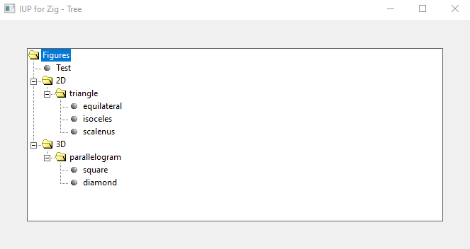
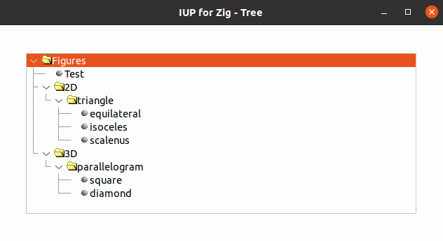

# IUP for Zig

## WIP Work in Progress

A [Zig language](https://ziglang.org/) idiomatic and type-checked bindings for [IUP Portable User Interface Toolkit](https://webserver2.tecgraf.puc-rio.br/iup/)

## Tree example

 Creates a tree with some branches and leaves. 
 Two callbacks are registered: one deletes marked nodes when the Del key is pressed, 
 and the other, called when the right mouse button is pressed, opens a menu with options.

Source code: [tree_example.zig](../src/tree_example.zig).

> Type `zig build tree` to run this example.

Converted from original example in C
https://webserver2.tecgraf.puc-rio.br/iup/examples/C/tree.c

## Screenshots

Windows Classic

Ubuntu

